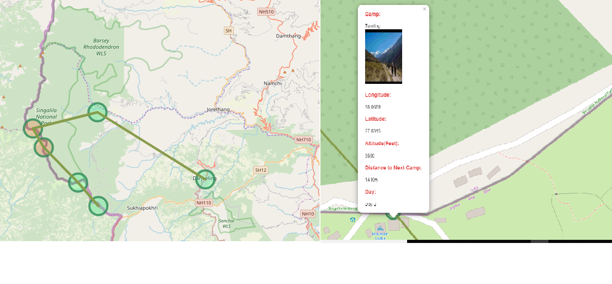

# Himalaya-Sub-terrain-tek-map-with-Leaflet-R-and-Python
 Indian Himalayan Sub terrain Map with Leaflet.js, R , Python (with automated emails)

This project is on the plotting of Popular Trail In Indian Himalayan region. This project is on Sandakphu trail. The plot documents the details of the trail with vital information like altitude, next camp distance, longitude and latitude. 

This project also contains the automated email system with Python. Any changes you make in the map, the script will detect the changes and will send an email to custom users about the same.Script also takes care of the device view issue, as everytime the plot is generated, the main.py file insert the code in header tag section of the html in order to take care of the device compatibility.R along with Leaflet,js is used for the Map plot. Python is used for main script which uses R to generate plot and sends email to the user.

## Version 2: Flask Application to create plot trek and email to custom users.

I will be releasing the version 2 of the project where user can come to one platform and plot any trek in the Himalayan region and can send the map to his fellow trekkers and friends vi email.

